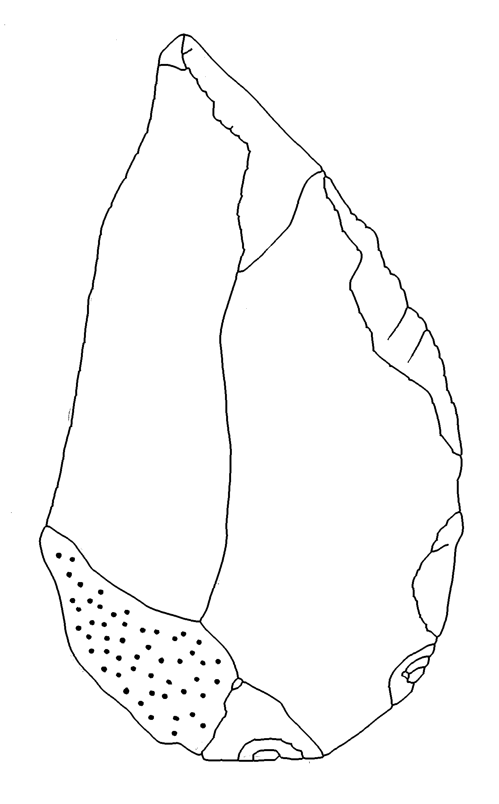

# Lithic Editor and Annotator

[](https://github.com/JasonGellis/lithic-editor/actions)
[](https://jasongellis.github.io/lithic-editor/)
[](https://opensource.org/licenses/MIT)
[](https://www.python.org/downloads/)

Lithic Editor removes the ripple lines from a scanned lithic drawing. It keeps the scar contours, the outline and the cortex stipple. You can then add direction arrows to the result.

**[Documentation](https://jasongellis.github.io/lithic-editor/)** | **[Report an issue](https://github.com/JasonGellis/lithic-editor/issues)**

| Input | Ripples removed | Arrows added |
|:---:|:---:|:---:|
|  |  |  |

## Features

- **Ripple removal.** The software builds a skeleton graph of the drawing. A line segment that ends in a free point is a ripple. All other segments are structure.
- **Cortex preservation.** The software separates the cortex stipple from the lines by area and adds it back to the result.
- **Upscaling for thin lines.** The software measures the line width and the hatch gap. When they are too small, it upscales the drawing 2, 3 or 4 times for processing. The neural models ESPCN and FSRCNN are included in the package. The software never downscales.
- **Line weight kept.** The output lines have the pen width of the input.
- **Output at the input size.** By default the result has the pixel size and the DPI of the input. A scale bar scanned with the drawing keeps its meaning. You can keep the upscaled size instead, with the scale bar scaled by the same factor.
- **Arrow annotation.** Add, move, rotate, resize and colour direction arrows in the GUI.
- **Brush tools.** Edit the input image before processing.
- **Debug images.** Examine the image after each processing step.
- **Three interfaces.** GUI, command line and Python API.

## Requirements

- Python 3.10 to 3.13
- Windows, macOS or Linux

pip installs all dependencies with the package. This includes `opencv-contrib-python`, which the neural models need.

## Installation

Install from GitHub:

```bash
pip install git+https://github.com/JasonGellis/lithic-editor.git
```

Or clone the repository and install in editable mode:

```bash
git clone https://github.com/JasonGellis/lithic-editor.git
cd lithic-editor
pip install -e .
```

## Usage

### GUI

```bash
lithic-editor gui
```

1. Click **Load Image** and select a drawing.
2. Click **Process Image**. If the lines are thin, a dialog offers to upscale for processing.
3. Add arrows to the result if necessary.
4. Click **Save Result**.

### Command line

```bash
lithic-editor process drawing.png -o output --auto-upscale
```

The result is written to `output/drawing_cleaned.png` with the DPI of the input. Add `--debug` to write the debug images. Add `--keep-upscaled --scale-image bar.png` to keep the upscaled size and to scale the scale bar with the drawing.

```bash
lithic-editor process --help   # All options
lithic-editor help             # Full help
lithic-editor help api         # Python API help
lithic-editor docs             # Open the documentation
```

### Python

```python
from lithic_editor.processing import process_lithic_drawing

result = process_lithic_drawing("drawing.png", dpi_info=300, upscale_low_dpi=True)
```

`result` is a NumPy array with black lines on a white background. See the [Python API reference](https://jasongellis.github.io/lithic-editor/api-reference/python-api/) for all parameters.

## How it works

1. Measure the line width and the hatch gap in pixels.
2. Upscale for processing when the line width is below 6 px or the hatch gap is below 12 px.
3. Smooth the image in proportion to the line width. This separates the tips of the hatch lines from the contours.
4. Threshold, separate the cortex stipple, and skeletonize the lines.
5. Bridge small breaks in the skeleton. Find the endpoints and the junctions.
6. Remove each segment that ends in a free point. Keep the rest.
7. Rebuild the lines at the pen width of the input. Add the cortex back.
8. Return the result at the input size and DPI.

See [Processing](https://jasongellis.github.io/lithic-editor/user-guide/processing/) for the full list of stages and debug images.

## Configuration

Every size threshold of the pipeline is in `lithic_editor/config/config.yaml`. Copy the file, change a value, and give the copy with `--config PATH`, with `config=` in Python, or with the environment variable `LITHIC_EDITOR_CONFIG`. See [Configuration](https://jasongellis.github.io/lithic-editor/user-guide/configuration/).

## Scale bars and measurement

Scan the scale bar as a separate image at the same DPI as the drawing. By default the result has the pixel size and the DPI of the input. The scale bar and the result keep one pixel scale. With **Keep the upscaled size**, load the scale image and the software saves it scaled by the same factor. The software never writes a guessed DPI tag.

## For developers

```bash
git clone https://github.com/JasonGellis/lithic-editor.git
cd lithic-editor
pip install -e ".[dev]"

pytest                            # Run the tests
ruff check lithic_editor tests    # Run the linter
python -m tools.dpi_eval.run --quick   # Evaluate the pipeline across resolutions
```

The evaluation harness runs the pipeline on the example drawings at 600, 300, 150 and 75 DPI. It writes a report with montages to `results/dpi_eval/`. See the [Developer Guide](https://jasongellis.github.io/lithic-editor/developer/contributing/) and the [Testing Guide](https://jasongellis.github.io/lithic-editor/developer/testing/).

## License

[MIT License](LICENSE)

## Acknowledgements

The British Academy funded the development of Lithic Editor.
