```mermaid
flowchart TB
    subgraph section1 ["Input & Preprocessing"]
        direction TB
        subgraph row1a [" "]
            direction LR
            A["Load Image"] --> B["Extract Metadata"]
            B --> C["Convert to Grayscale"]
            C --> D{"`DPI < 300?`"}
            D -->|Yes| E["Neural Network<br/>Upscaling"]
            D -->|No| F["Binary Threshold"]
            E --> F
        end

        subgraph row1b [" "]
            direction LR
            G["Separate Cortex"] --> H["Morphological<br/>Operations"]
        end

        F --> G
    end

    subgraph section2 ["Structural Analysis & Ripple Detection"]
        direction TB
        subgraph row2a [" "]
            direction LR
            I["Skeletonization"] --> J["Junction/Endpoint<br/>Detection"]
            J --> K["Line Segmentation"]
        end

        subgraph row2b [" "]
            direction LR
            L["Graph Construction"] --> M["Ripple<br/>Identification"]
            M --> N["Y-tip Junction<br/>Conversion"]
            N --> O["Structural Mask<br/>Creation"]
        end

        K --> L
    end

    subgraph section3 ["Output Generation"]
        direction LR
        P["DPI-Adaptive<br/>Thickness Reconstruction"] --> Q["Quality<br/>Enhancement"]
        Q --> R["Cortex<br/>Restoration"]
        R --> S["Final Output"]
    end

    H --> I
    O --> P

    style D fill:#f9f,stroke:#333,stroke-width:2px
    style E fill:#bbf,stroke:#333,stroke-width:2px
    style section1 fill:#f8f9fa,stroke:#dee2e6,stroke-width:2px
    style section2 fill:#fff3cd,stroke:#ffeaa7,stroke-width:2px
    style section3 fill:#d1ecf1,stroke:#bee5eb,stroke-width:2px
    style row1a fill:transparent,stroke:none
    style row1b fill:transparent,stroke:none
    style row2a fill:transparent,stroke:none
    style row2b fill:transparent,stroke:none
```

# Features

## Image Processing Pipeline

### Processing Workflow

<h4>Processing Steps</h4>

<h5>Input & Preprocessing</h5>

<strong>1. Image Loading and Metadata Extraction</strong> 
Reads image files and extracts embedded DPI information from EXIF metadata. Supports PNG, JPEG, TIFF, and BMP formats.

<strong>2. Grayscale Conversion</strong> 
Converts color images to 8-bit grayscale using luminance-preserving algorithms for consistent processing.

<strong>3. Neural Network Upscaling (Optional)</strong> 
Detects DPI from image metadata or prompts user for DPI selection. Upscales low-DPI images using ESPCN or FSRCNN models while maintaining aspect ratio and line quality to improve detail preservation.

<strong>4. Binary Thresholding</strong> 
Converts to grayscale if needed and employs Otsu's adaptive thresholding to create binary image, separating foreground lines from background.

<strong>5. DPI-Adaptive Cortex Separation</strong> 
Separates cortex stippling from structural lines using connected component analysis with DPI-scaled minimum/maximum thresholds. Filters noise pixels while preserving legitimate cortex stippling before skeletonization.

<strong>6. Morphological Operations</strong> 
Applies targeted morphological transformations exclusively to structural elements:

<ul>
<li>Dilation strengthens thin lines</li>
<li>Closing bridges small gaps</li>
<li>Opening smooths irregular edges</li>
</ul>

<h5>Structural Analysis & Ripple Detection</h5>

<strong>7. Skeletonization</strong> 
Reduces lines to single-pixel width using morphological thinning while preserving connectivity and topology to create network representation.

<strong>8. Junction and Endpoint Detection</strong> 
Analyzes skeleton connectivity to identify line terminations (endpoints) and intersections (junctions) through neighbor counting.

<strong>9. Line Segmentation</strong> 
Detects individual line segments and calculates orientation and length, creating discrete segments for individual analysis.

<strong>10. Graph Construction</strong> 
Builds connectivity graph using NetworkX with segments as edges and junctions/endpoints as nodes.

<strong>11. Y-tip Junction Conversion</strong> 
Converts junctions within DPI-scaled threshold distance (2-8 pixels) of endpoints to endpoints, eliminating Y-tip artifacts while preserving structural integrity.

<strong>12. Ripple Identification</strong> 
Identifies parallel line patterns and analyzes spacing consistency to classify segments as ripple or structural elements.

<strong>13. Selective Removal</strong> 
Removes identified ripple lines while preserving structural boundaries to maintain artifact integrity.

<h5>Output Generation</h5>

<strong>14. DPI-Adaptive Thickness Reconstruction</strong> 
Applies controlled dilation with DPI-scaled parameters (1-6 pixels) to restore original line thickness while preventing over-thickening at low resolutions.

<strong>15. Quality Enhancement</strong> 
Implements anti-aliasing and smoothing algorithms to produce publication-quality output.

<strong>16. Final Assembly</strong> 
Combines cleaned structural lines with preserved cortex and refines endpoint decisions after cleaning to create final archaeologically accurate result.

<strong>17. Final Output</strong> 
Produces cleaned image with proper contrast orientation and preserved metadata for publication use.

