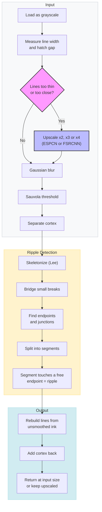

# Features

## Ripple Removal

The software removes the hatch lines (ripple lines) from a scanned lithic drawing. It keeps the scar contours, the outlines and the cortex stipple. The output is a black-on-white drawing.

### Processing Steps

The pipeline does these steps in this order.

1. **Load the image.** The software loads the image as grayscale. It reads the DPI from the file tag. If the file has no tag, the user gives the DPI. The software never guesses a DPI.

2. **Measure the line geometry.** The software measures the line width and the hatch gap in pixels.

3. **Upscale when needed.** The software upscales only when the lines are too thin or too close. The factor is 2, 3 or 4. It is the smallest factor that makes the line width at least 6 px and the hatch gap at least 12 px. The neural model is ESPCN (default) or FSRCNN. Both models are included in the package. The software never downscales.

4. **Smooth.** A Gaussian blur with sigma = 0.25 x line width separates the tips of the hatch lines from the contours they touch.

5. **Threshold.** A Sauvola threshold makes a binary image. The software also keeps a threshold of the unsmoothed image for step 12.

6. **Separate the cortex.** The software separates cortex stipple from lines by the area of each connected component. The area limits scale with the DPI.

7. **Skeletonize.** The software thins the lines to one pixel with the Lee method. It closes small gaps, thins again, and removes short spurs.

8. **Bridge small breaks.** The software connects free skeleton ends that are closer than about 1.5 x line width. The bridge is never longer than half a hatch gap. A contour with a small break stays closed.

9. **Find endpoints and junctions.** An endpoint has one neighbour. A junction has three or more neighbours. A junction very near an endpoint (a Y-tip) becomes an endpoint.

10. **Build a graph.** The software splits the skeleton at endpoints and junctions into segments. The segments are the edges of a graph.

11. **Classify the segments.** A segment that touches a free endpoint is a ripple. All other segments are structural.

12. **Rebuild the lines.** The software rebuilds the structural lines from the unsmoothed ink at a radius of half the measured line width. The lines keep the original pen weight. The software adds the cortex back and inverts the image to black on white.

13. **Return the result.** By default, the result has the pixel size and DPI of the input. With the keep-upscaled option, the result keeps the working size. The DPI tag is then the input DPI times the factor. A scale image is scaled by the same factor.

```mermaid
flowchart TB
    subgraph section1 ["Input"]
        direction LR
        A["Load as grayscale"] --> B["Measure line width<br/>and hatch gap"]
        B --> C{"Lines too thin<br/>or too close?"}
        C -->|Yes| D["Upscale x2, x3 or x4<br/>(ESPCN or FSRCNN)"]
        C -->|No| E["Gaussian blur"]
        D --> E
        E --> F["Sauvola threshold"]
        F --> G["Separate cortex"]
    end

    subgraph section2 ["Ripple Detection"]
        direction LR
        H["Skeletonize (Lee)"] --> I["Bridge small breaks"]
        I --> J["Find endpoints<br/>and junctions"]
        J --> K["Split into segments"]
        K --> L["Segment touches a free<br/>endpoint = ripple"]
    end

    subgraph section3 ["Output"]
        direction LR
        M["Rebuild lines from<br/>unsmoothed ink"] --> N["Add cortex back"]
        N --> O["Return at input size<br/>or keep upscaled"]
    end

    G --> H
    L --> M

    style C fill:#f9f,stroke:#333,stroke-width:2px
    style D fill:#bbf,stroke:#333,stroke-width:2px
    style section1 fill:#f8f9fa,stroke:#dee2e6,stroke-width:2px
    style section2 fill:#fff3cd,stroke:#ffeaa7,stroke-width:2px
    style section3 fill:#d1ecf1,stroke:#bee5eb,stroke-width:2px
```

### Debug Images

When debug output is on, the software writes one image for each step. The GUI shows the images in a panel and writes them to `image_debug/<name>/`. The command line writes them to the output directory with the `--debug` option.

In `6_<name>_ripple_identification.png`, red is ripple, white is structural, and green dots are junctions.

## Cortex Preservation

Cortex stipple is made of small marks. The software separates the marks from the lines by their area. The area limits scale with the DPI. The stipple is not part of the ripple detection. The software adds it back to the result.

You can turn this off. The software then processes the stipple as lines.

## Upscaling

Thin lines and narrow hatch gaps make ripple detection less accurate. The software measures both values in pixels. If a value is below its floor, the software can upscale the drawing before processing. The factor is 2, 3 or 4.

- In the GUI, a dialog shows the measured values and the factor. Choose the model, or decline to process at the original size.
- On the command line, use `--auto-upscale` to allow upscaling.

The neural models ESPCN and FSRCNN are included in the package. No download is needed.

## Arrow Annotation

The GUI has tools to add direction arrows to the processed drawing.

- Add Arrow, Arrow Color, Delete Arrow, Clear Arrows
- Drag to move an arrow
- Shift+drag to rotate an arrow
- Alt/Option+drag to resize an arrow
- Left and Right arrow keys rotate an arrow by 5 degrees
- Delete key removes the selected arrow

## Brush Tools

The GUI has brush tools to edit the input image before processing. Set the brush on or off, white or black, and size 1 to 20. Clear removes all brush strokes.

## Scale Image

A scale bar scanned with the drawing can be loaded as a separate image. With the keep-upscaled option, the software scales the scale image by the same factor as the drawing. It saves the scale image next to the result.

## Output

- **Formats**: PNG, JPEG or TIFF.
- **DPI tag**: The result keeps the DPI of the input. When the result is kept upscaled, the DPI tag is raised by the factor. No DPI tag is written when none is known.

## Interfaces

| Interface | Use |
|-----------|-----|
| GUI | Process one drawing, edit it, and add arrows |
| Command line | Process drawings from a terminal or a script |
| Python API | Process drawings from Python code |

See the [CLI reference](api-reference/cli-reference.md) and the [Python API](api-reference/python-api.md).
