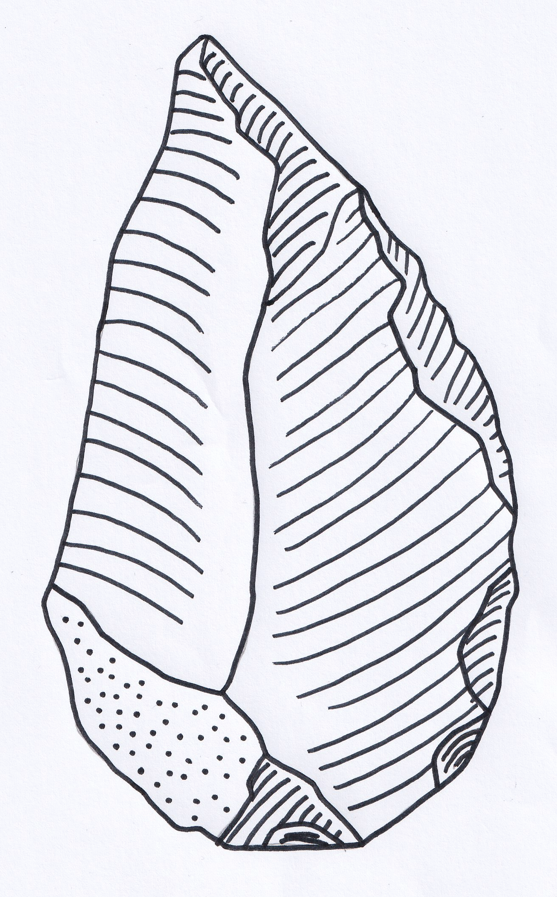
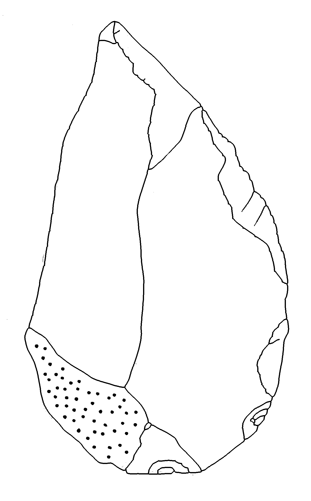
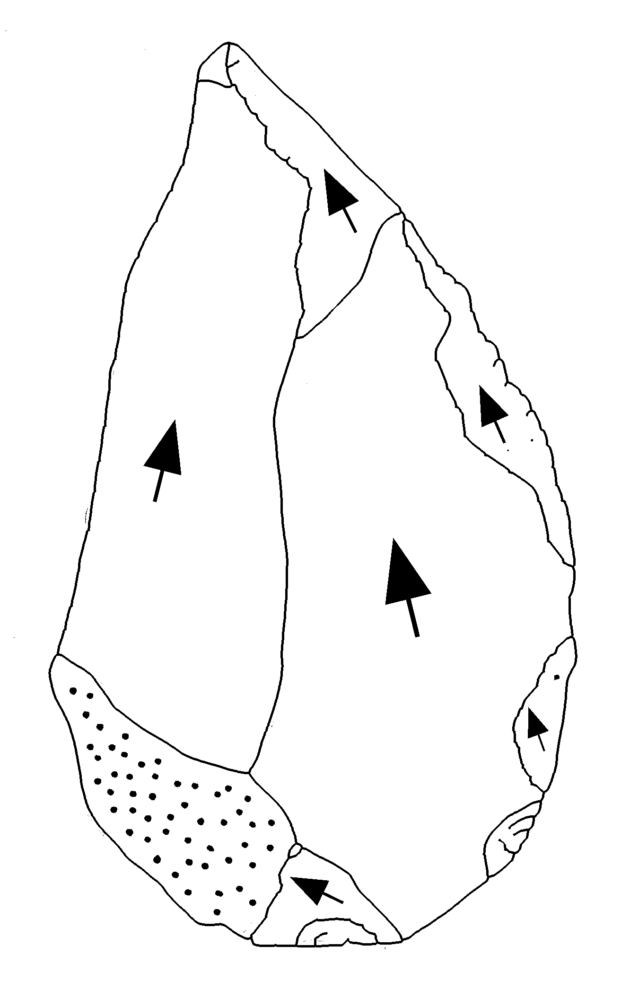

# Lithic Editor and Annotator

  <h2>Lithic Editor and Annotator</h2>
  
Advanced image processing tool for archaeological lithic analysis with ripple removal, cortex preservation, neural network upscaling, and image annotation

!!! success "Key Features"
    - {: style="width:24px; height:24px; vertical-align:middle; margin-right:8px"}**Intelligent Ripple Removal** - Advanced algorithms distinguish between structural elements and scar ripples
    - {: style="width:24px; height:24px; transform:rotate(-45deg); vertical-align:middle; margin-right:8px; filter:brightness(0)"}**Precise Annotations** - Add directional arrows to indicate striking patterns
    - {: style="width:24px; height:24px; vertical-align:middle; margin-right:8px; filter:brightness(0)"}**Enhanced Image Quality** - Neural network upscaling and DPI enhancement for detailed analysis and visualization
    - {: style="width:24px; height:24px; vertical-align:middle; margin-right:8px; filter:brightness(0)"}**Easy to Use** - Intuitive GUI and command-line interface
    - {: style="width:24px; height:24px; vertical-align:middle; margin-right:8px; filter:brightness(0)"}
    **Python API** - Programmatic access for batch processing and integration with analysis workflows

## What is Lithic Editor?

Lithic Editor and Annotator is a comprehensive image processing tool designed for
preparing archaeological lithic illustrations. It combines advanced computer vision
techniques with domain-specific knowledge to edit and enhance technical drawings of
stone tool artifacts. The software addresses multiple challenges in lithic
illustration preparation and enhancement:

  - **Automated Ripple Line Removal**: Uses sophisticated graph-based algorithms to identify and remove hatching/ripple lines while
  preserving essential structural elements and cortex features of the drawing.

  - **Cortex Preservation**: Distinguishes between structural elements and
   cortex stippling, ensuring that important surface texture information is maintained
   during processing.

  - **Neural Network Upscaling**: Employs deep learning models to
  enhance low-resolution images, upscaling drawings below 300 DPI for
  improved detail and analysis quality.

  - **Technical Annotation System**: Provides intuitive tools for replacing scar ripples
   with directional arrows to indicate striking direction and flake scar patterns,
  enabling clear communication of technological information.

  - **Flexible Integration**: Offers GUI, command-line, and Python API interfaces for
  seamless integration into diverse archaeological analysis workflows.

## Visual Example

    

      <h3>Before Processing</h3>
      
Original drawing with ripple lines and cortex stippling

      
    

    

      <h3>Ripple Removal</h3>
      
Clean structural elements with cortex preserved

      
    

    

      <h3>Arrow Annotations</h3>
      
Directional arrows indicate striking patterns

      
    

## Who is this for?

- **Archaeologists** working with lithic illustrations
- **Researchers** creating publication-ready images
- **Museum Curators** preparing artifact documentation
- **Students** studying archaeological illustration techniques

## Next Steps

Follow the [installation guide](getting-started/installation.md) to set up Lithic Editor on your computer.
