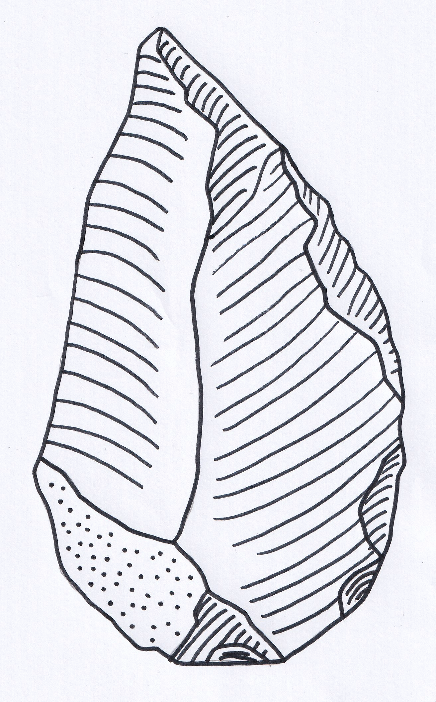

# Lithic Illustrations

## Introduction

This page gives the image requirements for Lithic Editor and Annotator. A good input gives a good result.

## File formats

The GUI opens PNG, JPEG, BMP and TIFF files.

- **PNG**: lossless. Recommended.
- **TIFF**: lossless. Good for archives.
- **JPEG**: lossy. Compression artifacts can break thin lines.
- **BMP**: uncompressed. Large files.

## Image quality

  
  

    A lithic flake drawing at 300 DPI with ripple lines, cortex stipple and clear scar contours.
  

The best input is a clean black line drawing on a white background, scanned at 300 to 600 DPI and saved as PNG.

- **Contrast**: black lines on white. Gray lines on an off-white background decrease the accuracy.
- **Lines**: continuous strokes for the outline and the scar contours. The pipeline bridges only small breaks, about 1.5 times the line width.
- **Ripple lines**: each ripple line starts at one edge of the scar and ends before the opposite edge. The pipeline identifies a ripple by its free end.
- **Noise**: no scanner artifacts and no background texture.
- **One drawing for each image**: the pipeline processes one lithic drawing at a time.

## Resolution and DPI

The DPI comes from the file tag. If the file has no tag, the application asks you for the DPI. The pipeline does not guess a DPI. See [Output](output.md) for the DPI tag of the saved file.

The pipeline measures the line width and the hatch gap in pixels. When the line width is below 6 px or the hatch gap is below 12 px, the application offers to upscale the image for processing. See [Processing Images](processing.md). A 75 DPI or 150 DPI scan is upscaled in this way. Scan at 300 to 600 DPI to avoid the upscale step.

## Scale bar

Keep the scale bar in a separate image. Scan it at the same DPI as the drawing. Load it with **Load Scale Image...** (GUI) or `--scale-image` (CLI). See [Output](output.md).

## Preparation

1. Scan in black and white or grayscale mode at 300 to 600 DPI.
2. Save as PNG or TIFF with the DPI tag.
3. Remove text, labels and the scale bar from the drawing image.
4. Close large gaps in the outline and the scar contours. Use the brush in the GUI or an image editor.
5. Keep one drawing in each image.

## Cortex stipple

The pipeline separates the cortex stipple from the lines by component area. It adds the stipple back at the end. **Keep the cortex stipple** is on by default. Turn it off to process the stipple as lines.

## Next steps

Continue to [Processing Images](processing.md).
