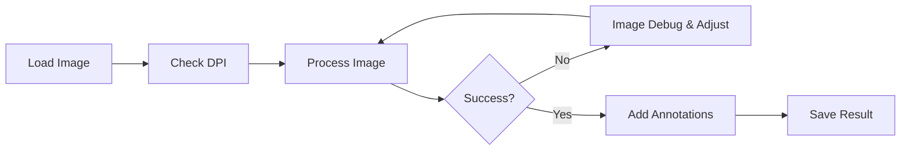

# User Guide Overview

## Introduction

This section covers all aspects of the Lithic Editor and Annotator GUI.

## Launch Lithic Editor GUI

To launch the application GUI from your terminal:
```bash
lithic-editor --gui
```

## Main Interface

The Lithic Editor interface contains eight main sections:

### 1. File Controls (Top Left)
- **Load Image** - Select input file
- **Process Image** - Start ripple removal
- **Save Result** - Export processed image
- **Exit** - Close application

### 2. Drawing Tools (Left, Below File Controls)

The brush tool is used to edit images in the **Input Image** window and will not affect your original image.

- **Activate Brush** - Enable/disable brush editing
- **Color** - Choose brush color (White/Black)
- **Size** - Adjust brush size (1-10)
- **Clear Brush** - Reset brush settings and clear brush marks

### 3. Arrow Annotations (Left, Below Drawing Tools)

After ripples are remove arrows can be added to indicate striking direction.

- **Add Arrow** - Create new arrow
- **Arrow Color** - Change arrow color
- **Delete Arrow** - Remove selected arrow
- **Clear Arrows** - Remove all arrows
- **Rotate** - Shift+drag to rotate
- **Rresize** - Option+drag to resize

### 4. Options and DPI Settings (Top Right)
- **Debug Images** - View and save debug images (checkbox). Images load in **Processing Steps** window. Images automatically saved to image_debug directory. Unchecked by default
- **Preserve Cortex Stippling** - Keep cortex texture (checkbox). Checked by default
- **DPI Settings** - Leave unset or set custom DPI

### 5. Input Image Window (Center Left)
- Shows imported image copy of original drawing

### 6. Processed Image / Arrow Annotations (Center)
- Shows cleaned result after processing
- Canvas for arrow annotation overlay

### 7. Processing Steps (Center Right when enabled)
- Debug visualization window
- Appears when debug images option is enabled (hidden by default)

### 8. Processing Log (Bottom)
- Shows real-time processing information
- Displays brush settings and status messages

### 9. Processing Status (Bottom)
- Shows current application state ("Ready", processing status)


## Navigation

Use the sidebar to explore specific topics:

- [Processing Images](../user-guide/processing.md) - Detailed processing guide
- [Adding Annotations](../user-guide/arrows.md) - Arrow annotation techniques
- [Saving Results](../user-guide/output.md) - Export options and formats


## Workflow Overview

The typical workflow for processing lithic drawings follows these steps:



#### Research Documentation
1. Process with debug enabled
2. Save all intermediate steps
3. Document parameters used
4. Archive original and processed versions

## Understanding the Algorithm

The ripple removal algorithm works through several stages:

### Stage 1: Skeletonization
Reduces lines to single-pixel width while preserving connectivity.

### Stage 2: Graph Construction
Builds a network representation of line segments.

### Stage 3: Pattern Analysis
Identifies ripple patterns based on:
- Line orientation
- Spacing consistency
- Length distribution

### Stage 4: Selective Removal
Removes identified ripple lines while preserving:
- Structural boundaries
- Tool edges
- Important features

### Stage 5: Enhancement
Cleans up the result and restores line quality.

## Tips and Tricks

!!! tip "Quick Processing"
    For faster processing of large images, resize to 2000-3000px maximum dimension first.

!!! tip "Arrow Visibility"
    Use contrasting colors for arrows - black on light backgrounds, white on dark.

!!! tip "Batch Operations"
    Use the CLI for processing multiple images with consistent settings.

!!! tip "Quality Control"
    Enable "View and Save Debug Images" and review the processing steps to ensure important features aren't removed.


## Getting Support

If you need help:

1. **Check Documentation**: Review relevant guide sections
2. **GitHub Issues**: Search existing issues or create new one
3. **Community Forum**: Ask in GitHub Discussions
4. **Direct Contact**: Email jg760@cam.ac.uk for research inquiries

## Next Steps

- Continue to [Processing Images](../user-guide/processing.md) for detailed processing instructions
- Explore [Output and Saving Options](../user-guide/output.md) for export settings and saving images