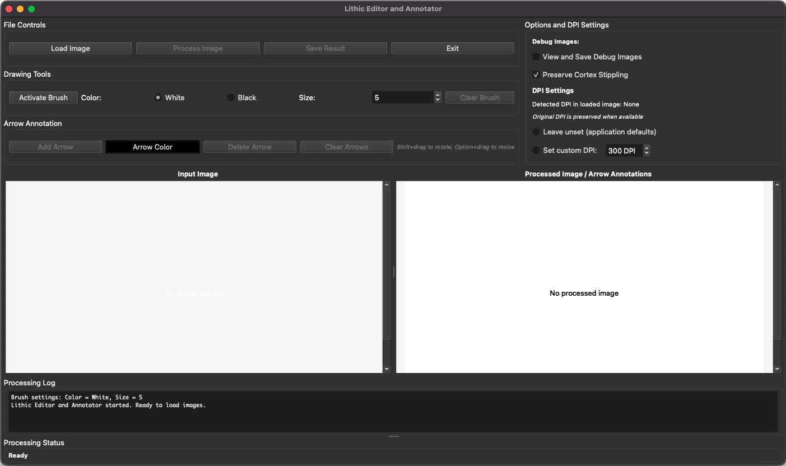

# User Guide Overview

## Introduction

This section covers all aspects of the Lithic Editor and Annotator GUI.

## Launch Lithic Editor GUI

To launch the application GUI from your terminal:
```bash
lithic-editor --gui
```

## Main Interface



The Lithic Editor interface contains eight main sections:

### 1. File Controls (Top Left)
- **Load Image** - Select input file
- **Process Image** - Start ripple removal
- **Save Result** - Export processed image
- **Exit** - Close application

### 2. Drawing Tools (Left, Below File Controls)

The brush tool is used to edit images in the **Input Image** window and will not affect your original image.

- **Activate Brush** - Enable/disable brush editing
- **Color** - Choose brush color (White/Black)
- **Size** - Adjust brush size (1-10)
- **Clear Brush** - Reset brush settings and clear brush marks

### 3. Arrow Annotations (Left, Below Drawing Tools)

After ripples are remove arrows can be added to indicate striking direction.

- **Add Arrow** - Create new arrow
- **Arrow Color** - Change arrow color
- **Delete Arrow** - Remove selected arrow
- **Clear Arrows** - Remove all arrows
- **Rotate** - Shift+drag to rotate
- **Rresize** - Option+drag to resize

### 4. Options and DPI Settings (Top Right)
- **Debug Images** - View and save debug images (checkbox).
    - Images load in **Processing Steps** window.
    - Images automatically saved to image_debug directory.
    - Unchecked by default
- **Preserve Cortex Stippling** - Keep cortex texture (checkbox). Checked by default
- **DPI Settings** - Leave unset or set custom DPI

### 5. Input Image Window (Center Left)
- Shows imported image copy of original drawing

### 6. Processed Image / Arrow Annotations (Center)
- Shows cleaned result after processing
- Canvas for arrow annotation overlay

### 7. Processing Steps (Center Right when enabled)
- Debug visualization window
- Appears when debug images option is enabled (hidden by default)

### 8. Processing Log (Bottom)
- Shows real-time processing information
- Displays brush settings and status messages

### 9. Processing Status (Bottom)
- Shows current application state ("Ready", processing status)

## Next Steps

- Continue to [Processing Images](../user-guide/processing.md) for detailed processing instructions
- Explore [Output and Saving Options](../user-guide/output.md) for export settings and saving images