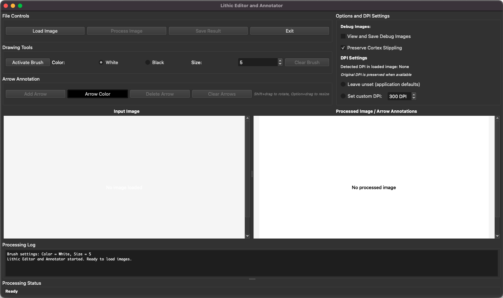

# Interface

## Introduction

This page describes the controls of the Lithic Editor and Annotator GUI.

## Start the GUI

Run one of these commands in a terminal:

```bash
lithic-editor gui
```

```bash
lithic-editor --gui
```

## Main window



The main window has these areas.

### File Controls (top left)

| Button | Function |
|--------|----------|
| **Load Image** | Opens an image file. Accepted formats: PNG, JPEG, BMP and TIFF. The application crops the image to its content. |
| **Process Image** | Starts ripple removal. Available after you load an image. |
| **Save Result** | Saves the processed image with its arrows. Available after processing. |
| **Exit** | Closes the application. |

### Drawing Tools (left, below File Controls)

The brush draws on the copy of the input image in the **Input Image** panel. It does not change the file on disk. Processing uses the edited copy.

- **Activate Brush**: turns the brush on or off. The button shows "Brush Active" when the brush is on.
- **Color**: White or Black. White is the default.
- **Size**: brush size in pixels, 1 to 20. The default is 5.
- **Clear Brush**: removes all brush marks from the input image.

### Arrow Annotation (left, below Drawing Tools)

These controls become available after processing. See [Arrow Annotations](arrows.md).

- **Add Arrow**: puts a new arrow at the center of the processed image.
- **Arrow Color**: opens a color dialog. New arrows get this color.
- **Delete Arrow**: removes the selected arrow.
- **Clear Arrows**: removes all arrows.

The panel also shows the mouse actions: Shift+drag to rotate, Option+drag (macOS) or Alt+drag (Windows, Linux) to resize.

### Options (top right)

**Processing**

- **Keep the cortex stipple**: keeps the cortex stipple in the result. On by default.

**Output**

- **Keep the upscaled size**: keeps the result at the upscaled working size. Off by default. See [Output](output.md).
- **Load Scale Image...**: selects an optional scale bar image scanned with the drawing. The label next to the button shows the file name.

**Debug**

- **Show and save the debug images**: shows the debug images in the **Processing Steps** panel and writes them to `image_debug/<name>/`. Off by default.

**Configuration**

- **Load Configuration...**: selects a configuration file. See [Configuration](configuration.md).
- **Reset to default**: uses the configuration file shipped with the package.
- The label shows the file in use. Point at the label to see its full path.

**DPI**

- Shows the DPI found in the loaded image. When the file has a DPI, that DPI is kept.
- When the file has no DPI, two options appear:
    - **No DPI value**: the saved file gets no DPI tag.
    - **Set the DPI**: the saved file gets this DPI tag (72 to 1200).

### Input Image (center left)

Shows the loaded image after the crop to its content. Brush marks appear here.

### Processed Image / Arrow Annotations (center)

Shows the processed image. Arrows appear here.

### Processing Steps (right)

Shows the debug images. The panel is visible only when **Show and save the debug images** is on.

### Processing Log (bottom)

Shows messages from the application and the pipeline: DPI, image size, measured line width and hatch gap, upscale decisions and save paths.

### Processing Status (bottom)

Shows the current state, for example "Ready", "Processing..." or "Processing complete". A progress bar is visible during processing.

## Next steps

- [Processing Images](processing.md)
- [Output](output.md)
