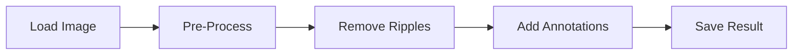

# User Guide Overview

## Introduction

This comprehensive guide covers all aspects of using Lithic Editor and Annotator for processing archaeological lithic drawings. Whether you're new to the software or looking to master advanced features, this guide will help you achieve professional results.

## Workflow Overview

The typical workflow for processing lithic drawings follows these steps:



## Quick Start Tutorial

Launch the application:
```bash
lithic-editor --gui
```

### Step 1: Load Your Image
1. Click **"Load Image"** button
2. Select a lithic drawing file (PNG, JPEG, TIFF, or BMP)
3. Image appears in the Input Image panel

### Step 2: Process the Image
1. Click **"Process Image"** button
2. Wait for processing to complete (5-30 seconds)
3. View the cleaned result in Processed Image panel

### Step 3: Add Annotations (Optional)
1. Click **"Add Arrow"** - arrow appears in center
2. **Drag** to position over feature
3. **Shift+drag** to rotate to desired angle
4. **Alt/Option+drag** to resize

### Step 4: Save Your Result
1. Click **"Save Result"** button
2. Choose format (PNG recommended)
3. Select output location

## Main Interface

The Lithic Editor interface contains eight main sections:

### 1. File Controls (Top Left)
- **Load Image** - Select input file
- **Process Image** - Start ripple removal
- **Save Result** - Export processed image
- **Exit** - Close application

### 2. Drawing Tools (Top Left, Below File Controls)
- **Activate Brush** - Enable/disable brush editing
- **Color** - Choose brush color (White/Black)
- **Size** - Adjust brush size (1-10)
- **Clear Brush** - Reset brush settings

### 3. Arrow Annotations (Bottom Left)
- **Add Arrow** - Create new arrow
- **Arrow Color** - Change arrow color
- **Delete Arrow** - Remove selected arrow
- **Clear Arrows** - Remove all arrows

### 4. Options and DPI Settings (Top Right)
- **Debug Images** - View and save debug images (checkbox)
- **Preserve Cortex Stippling** - Keep cortex texture (checkbox)
- **DPI Settings** - Leave unset or set custom DPI

### 5. Input Image Window (Center Left)
- Displays original drawing
- Shows loaded image

### 6. Processed Image / Arrow Annotations (Center Right)
- Shows cleaned result after processing
- Canvas for arrow annotation overlay

### 7. Processing Steps (Right Panel)
- Debug visualization window
- Appears when debug images option is enabled

### 8. Processing Log (Bottom)
- Shows real-time processing information
- Displays brush settings and status messages

### 9. Processing Status (Bottom)
- Shows current application state ("Ready", processing status)

## Core Functions

### Image Loading
- Support for multiple formats
- Automatic DPI detection
- Image validation and error checking

### Processing Engine
- Graph-based line analysis
- Pattern recognition algorithms
- Structural preservation logic

### Annotation System
- Vector-based arrows
- DPI-aware sizing
- Export-ready graphics

## Navigation

Use the sidebar to explore specific topics:

- [Processing Images](processing.md) - Detailed processing guide
- [Adding Annotations](annotations.md) - Arrow annotation techniques
- [Saving Results](saving.md) - Export options and formats
- [Keyboard Shortcuts](shortcuts.md) - Productivity tips

## Best Practices

### For Optimal Results

1. **Image Preparation**
   - Use high-resolution scans (300+ DPI)
   - Ensure good contrast
   - Remove unnecessary elements

2. **Processing Settings**
   - Enable "View and Save Debug Images" for complex images
   - Review intermediate steps in Processing Steps panel
   - Set custom DPI if needed (default preserves original)

3. **Annotation Guidelines**
   - Maintain consistent arrow sizes
   - Use appropriate colors
   - Align with archaeological standards

### Common Workflows

#### Single Image Processing
1. Load image
2. Process
3. Annotate
4. Save

#### Batch Processing
1. Prepare image folder
2. Use CLI for batch operations
3. Review results
4. Apply annotations as needed

#### Research Documentation
1. Process with debug enabled
2. Save all intermediate steps
3. Document parameters used
4. Archive original and processed versions

## Understanding the Algorithm

The ripple removal algorithm works through several stages:

### Stage 1: Skeletonization
Reduces lines to single-pixel width while preserving connectivity.

### Stage 2: Graph Construction
Builds a network representation of line segments.

### Stage 3: Pattern Analysis
Identifies ripple patterns based on:
- Line orientation
- Spacing consistency
- Length distribution

### Stage 4: Selective Removal
Removes identified ripple lines while preserving:
- Structural boundaries
- Tool edges
- Important features

### Stage 5: Enhancement
Cleans up the result and restores line quality.

## Tips and Tricks

!!! tip "Quick Processing"
    For faster processing of large images, resize to 2000-3000px maximum dimension first.

!!! tip "Arrow Visibility"
    Use contrasting colors for arrows - black on light backgrounds, white on dark.

!!! tip "Batch Operations"
    Use the CLI for processing multiple images with consistent settings.

!!! tip "Quality Control"
    Enable "View and Save Debug Images" and review the processing steps to ensure important features aren't removed.

## Troubleshooting Guide

### Processing Issues

| Problem | Solution |
|---------|----------|
| Structural lines removed | Adjust algorithm sensitivity |
| Ripples not fully removed | Check image contrast |
| Processing too slow | Reduce image size |
| Memory errors | Close other applications |

### Annotation Issues

| Problem | Solution |
|---------|----------|
| Arrows too small | Increase DPI setting |
| Can't select arrow | Click closer to arrow center |
| Arrows disappear | Check arrow color vs background |

## Getting Support

If you need help:

1. **Check Documentation**: Review relevant guide sections
2. **GitHub Issues**: Search existing issues or create new one
3. **Community Forum**: Ask in GitHub Discussions
4. **Direct Contact**: Email jg760@cam.ac.uk for research inquiries

## Next Steps

- Continue to [Processing Images](processing.md) for detailed processing instructions
- Jump to [Annotations](annotations.md) to master arrow tools
- Explore [Saving Options](saving.md) for export settings