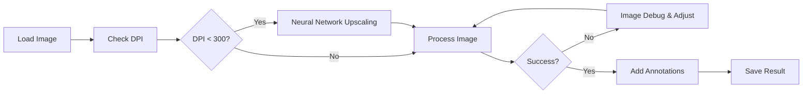

# Processing Images

This documentation provides comprehensive guidance for utilizing the graphical user interface (GUI) to remove ripples from individual images. For batch processing workflows and programmatic integration, refer to the [Command Line Interface](../api-reference/cli-reference.md) and [Python API](../api-reference/python-api.md) documentation.

## Workflow Overview

The typical workflow for processing lithic drawings follows these steps:


## Step-by-Step Processing

### Loading Images

For image requirements and preparation guidelines, see [Lithic Illustrations](images.md).

1. **Load Your Image**
   ```
   Click "Process Image" → Wait for completion
   ```

2. **DPI Detection and Upscaling**
    - System automatically detects DPI from image metadata (**Options and DPI Settings** panel & **Processing Log**)
    - If missing, dialog prompts for DPI selection (72, 96, 150, 200 or custom)
    - If below 300 DPI, upscaling dialog offers ESPCN/FSRCNN options
    - **DPI-Aware Processing**: Algorithm automatically adapts parameters based on detected DPI:
      - **Y-tip removal**: 2-8 pixel thresholds scale with resolution
      - **Cortex filtering**: Minimum/maximum thresholds prevent noise at all DPIs
      - **Thickness reconstruction**: 1-6 pixel parameters preserve line quality

3. **Review Input**
    - Check image quality in the **Input Image** window
    - Note any problem areas

4. **Process Image**
    - Click "Process Image" → Wait for completion

5. **Review Results**
    - Compare before/after images in **Input Image** and **Processed Image/Arrow Annotations** windows
    - Verify structural preservation (scars and borders) and ripple removal
    - Check that Y-tip artifacts have been eliminated while maintaining structural integrity

6. **Evaluate Processing Quality**
    - If results are satisfactory, proceed to the [arrow annotation phase](arrows.md)
    - If refinement is needed, utilize debug mode for detailed analysis

### Processing Debug Options

#### Debug Mode
Enable to view and save intermediate processing steps:
- Checkbox: "View and Save Debug Images"
- Shows processing steps in the Processing Steps panel
- Creates `image_debug/` folder with all algorithm stages

### Quality Control

!!! tip "Always Review Debug Images"
    Enable debug mode for important images to verify the algorithm isn't removing structural elements.


## Best Practices

### For Optimal Results

1. **Image Preparation**
   - Use high-resolution scans (300+ DPI)
   - Ensure good contrast
   - Remove unnecessary elements

2. **Processing Settings**
   - Enable "View and Save Debug Images" for complex images
   - Review intermediate steps in Processing Steps panel
   - Set custom DPI if needed (default preserves original)

3. **Annotation Guidelines**
   - Maintain consistent arrow sizes
   - Use appropriate colors
   - Align with archaeological standards


## Next Steps

- Continue to [Arrow Annotations](arrows.md) for information about output files and formats