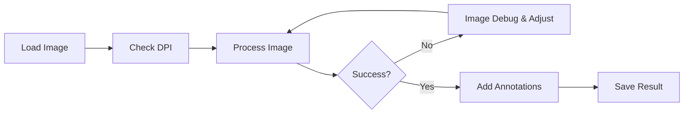

# Processing Images

The image processing engine in Lithic Editor uses advanced algorithms to automatically identify and remove ripple lines while preserving the structural elements of lithic drawings.

## Workflow Overview

The typical workflow for processing lithic drawings follows these steps:



## Loading Images

### Supported Formats
- **PNG** (recommended): Lossless compression, transparency support
- **JPEG/JPG**: Widely compatible, smaller file sizes
- **TIFF/TIF**: Professional quality, uncompressed
- **BMP**: Simple format, uncompressed

### Image Requirements
For best results, your images should have:
- High contrast (black lines on white background)
- Resolution of at least 300 DPI (automatic upscaling available for lower DPI)
- Clean, continuous lines
- Minimal noise or artifacts

### Neural Network Upscaling
Lithic Editor includes ESPCN and FSRCNN neural network models to automatically upscale low-DPI images:
- **ESPCN**: Efficient Sub-Pixel CNN, faster processing
- **FSRCNN**: Fast Super-Resolution CNN, higher quality
- **Automatic DPI detection** from image metadata
- **User dialogs** for DPI selection when metadata is missing
- **300 DPI target** for optimal processing results

For technical details about these super-resolution models, see [OpenCV Super Resolution Tutorial](https://learnopencv.com/super-resolution-in-opencv/#sec3).

### Cortex Preservation
Automatically preserves natural cortex stippling on lithic artifacts:
- **Intelligent separation**: Distinguishes cortex stippling from structural lines
- **Pre-processing preservation**: Cortex bypasses destructive skeletonization
- **Archaeological accuracy**: Maintains cortex vs. worked surface distinction
- **User control**: Toggle preservation on/off via GUI checkbox or CLI flag

## Processing Algorithm

### How It Works

The ripple removal algorithm follows these steps:

1. **Neural Network Upscaling** (if needed)
   - Detect DPI from image metadata or prompt user
   - Upscale low-DPI images using ESPCN/FSRCNN models
   - Maintain aspect ratio and line quality

2. **Image Preprocessing & Cortex Separation**
   - Convert to grayscale if needed
   - Apply threshold to create binary image
   - Separate cortex stippling from structural lines
   - Preserve cortex areas before skeletonization

3. **Skeletonization**
   - Reduce lines to single-pixel width
   - Preserve connectivity and topology
   - Create network representation

4. **Line Analysis**
   - Detect individual line segments
   - Calculate orientation and length
   - Build connectivity graph

5. **Ripple Detection**
   - Identify parallel line patterns
   - Analyze spacing consistency
   - Classify as ripple or structural

6. **Selective Removal**
   - Remove identified ripple lines
   - Preserve structural boundaries
   - Maintain artifact integrity

7. **Final Assembly**
   - Combine cleaned structural lines with preserved cortex
   - Refine endpoint decisions after cleaning
   - Create final archaeologically accurate result

## Using the GUI

### Step-by-Step Processing

1. **Load Your Image**
   ```
   Click "Load Image" → Select file → Open
   ```

2. **DPI Detection and Upscaling**
   - System automatically detects DPI from image metadata
   - If missing, dialog prompts for DPI selection (72, 96, 150, 200 or custom)
   - If below 300 DPI, upscaling dialog offers ESPCN/FSRCNN options

3. **Review Input**
   - Check image quality in Input panel
   - Verify correct orientation
   - Note any problem areas

4. **Process Image**
   ```
   Click "Process Image" → Wait for completion
   ```

5. **Review Results**
   - Compare before/after
   - Check debug steps if enabled
   - Verify structural preservation

### Processing Options

#### Debug Mode
Enable to view and save intermediate processing steps:
- Checkbox: "View and Save Debug Images"
- Shows processing steps in the Processing Steps panel
- Creates `image_debug/` folder with all algorithm stages

#### Quality Settings
Adjust processing parameters:
- Line thickness tolerance
- Ripple pattern sensitivity
- Structural preservation level

### Quality Control

!!! tip "Always Review Debug Images"
    Enable debug mode for important images to verify the algorithm isn't removing structural elements.


## Best Practices

### For Optimal Results

1. **Image Preparation**
   - Use high-resolution scans (300+ DPI)
   - Ensure good contrast
   - Remove unnecessary elements

2. **Processing Settings**
   - Enable "View and Save Debug Images" for complex images
   - Review intermediate steps in Processing Steps panel
   - Set custom DPI if needed (default preserves original)

3. **Annotation Guidelines**
   - Maintain consistent arrow sizes
   - Use appropriate colors
   - Align with archaeological standards


### Parallel Processing (using the API)
```python
from multiprocessing import Pool
from lithic_editor.processing import process_lithic_drawing

def process_file(filename):
    return process_lithic_drawing(filename)

with Pool(processes=4) as pool:
    results = pool.map(process_file, file_list)
```

## Next Steps

- Continue to [Output Guide](output.md) for information about output files and formats